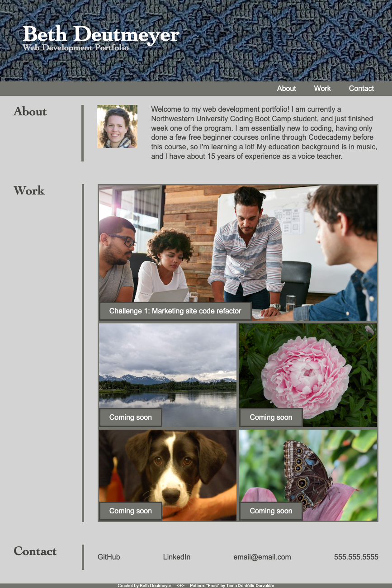

# Project Portfolio

## Description

This webpage is a portfolio (currently a VERY small portfolio) of my web development projects as of 9/18/23. The header contains my name (Beth Deutmeyer) and page navigation links.

The "About" section contains a photo of me and a brief paragraph. 

The next section, "Work," starts off with the hero photo from the marketing refactor challenge. That photo links to the live site from that challenge. Below that are smaller photos captioned "Coming soon," which act as placeholders for future projects.

The final section, "Contact," contains links to my GitHub overview and LinkedIn profiles, as well as placeholders for email and phone.

The footer contains info about the header background image, including credit and link for the crochet pattern designer.

## Screenshot

Below is a screenshot of the deployed webpage:



## Live link

Link to live site: https://bdeutmeyer.github.io/project-portfolio/

## Credits
I did not write the CSS reset code; it was copied and pasted, along with all the comments inside, from the ```reset.css``` file provided in Unit 2, Module 12. 

The marketing refactor challenge photo was provided by the boot camp in the materials for that challenge. The headshot photo was taken by The Joy of Photography: https://www.thejoyofphotography.biz/ . The dog photo was taken by Adel Veterinary Clinic, and pictures my dog Cassie. All other photos are my own.

## License

MIT (see license file for details)